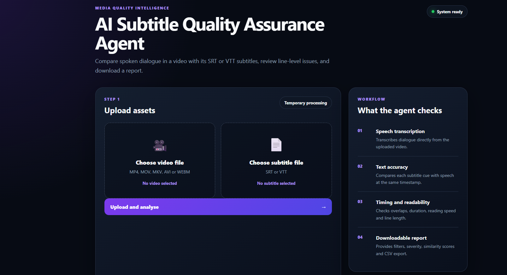
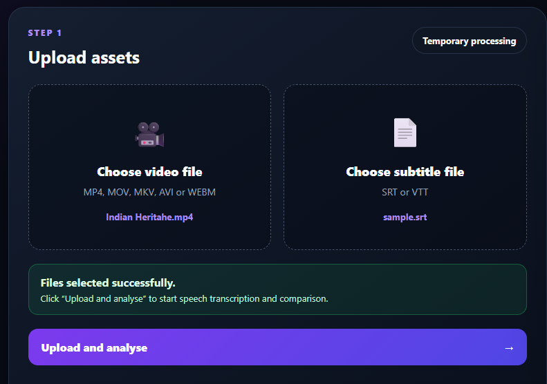
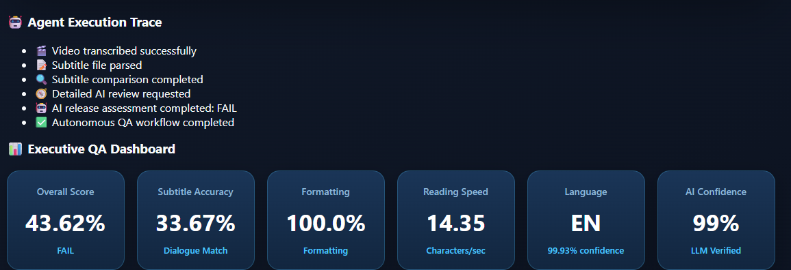
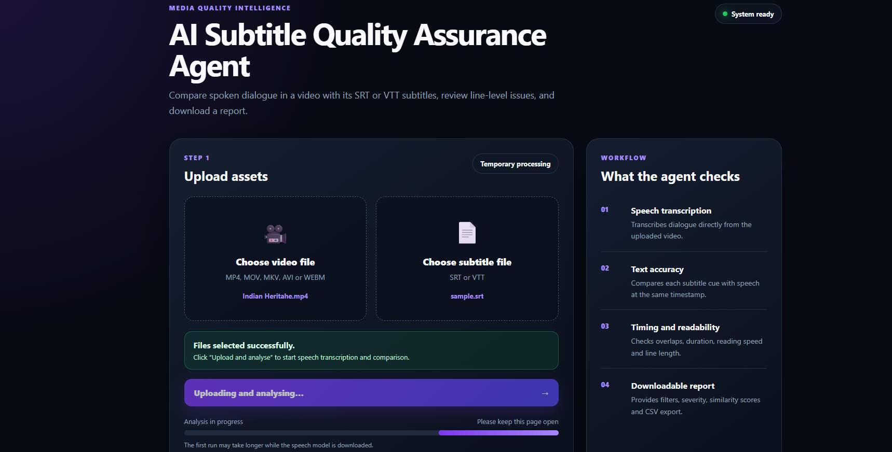
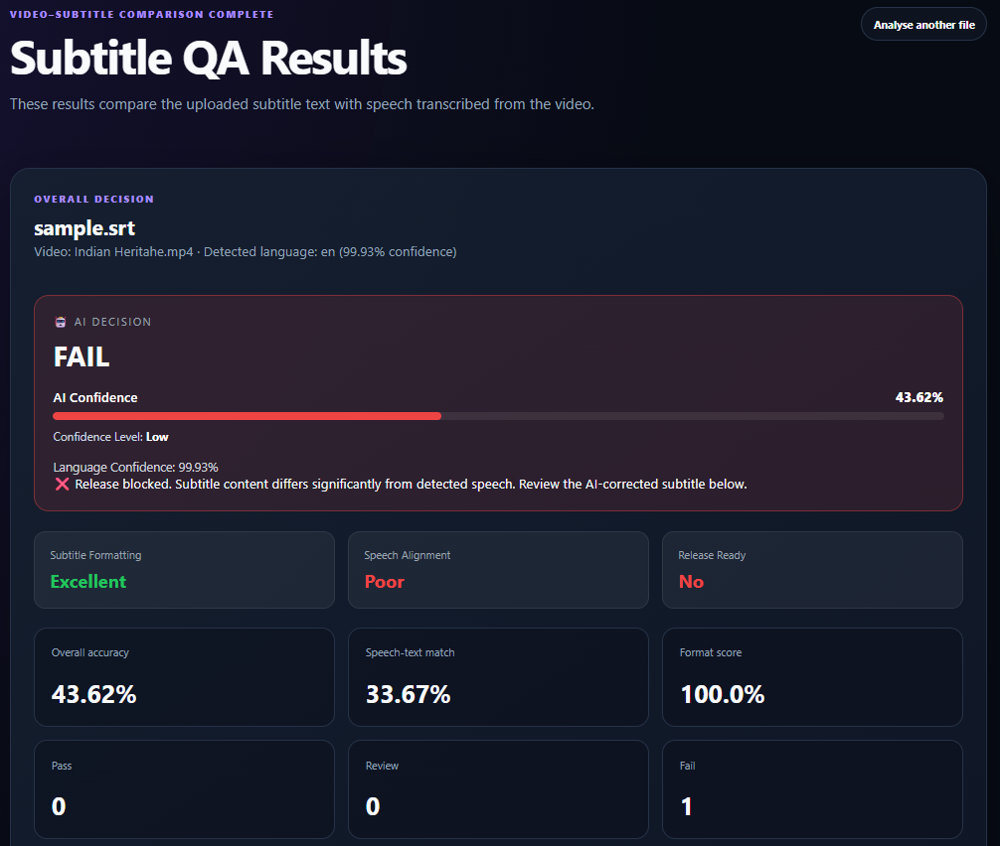
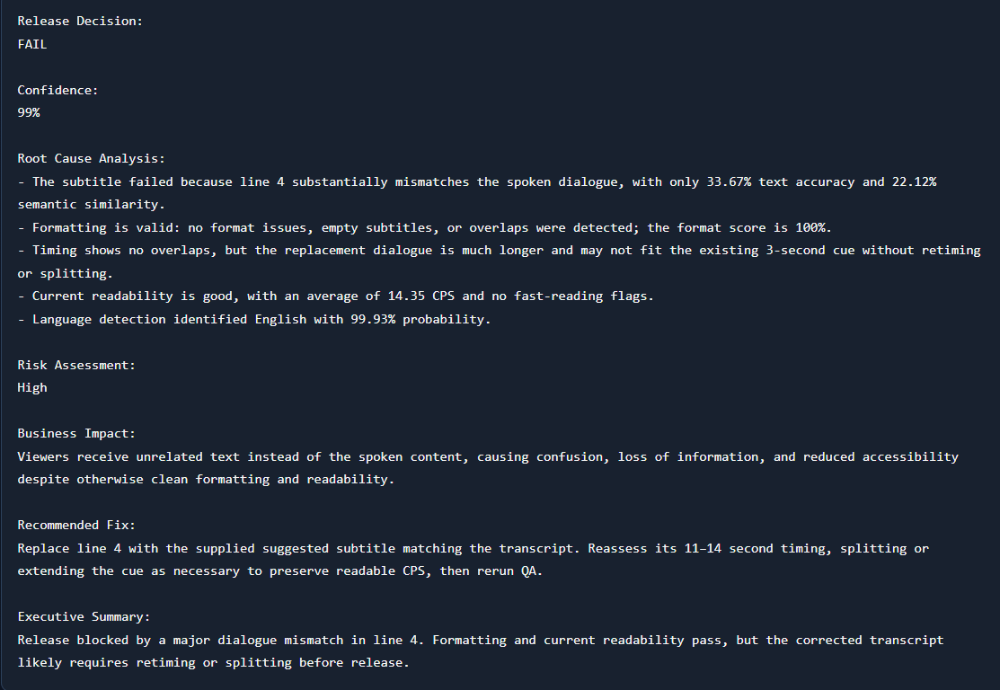
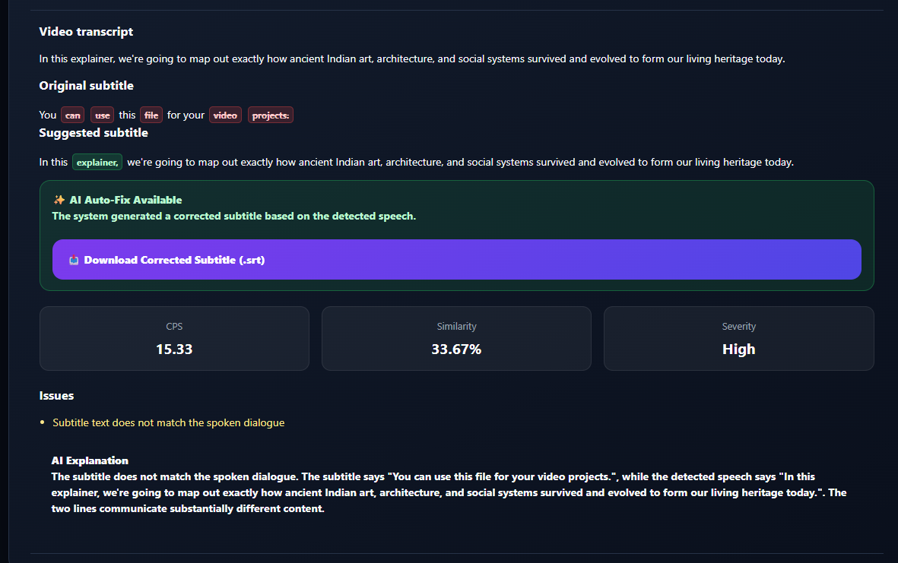
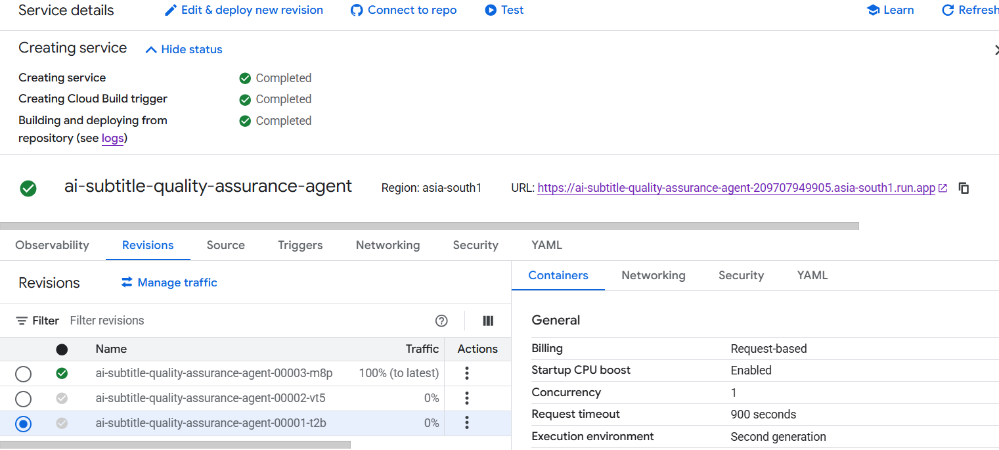

<div align="center">

# AI Subtitle Quality Assurance Agent

### Intelligent AI-powered Subtitle Verification & Release Readiness Platform


An AI-powered Quality Assurance system that automatically validates subtitle accuracy by comparing subtitle text with speech transcribed directly from video using Large Language Models.

Designed to simulate enterprise-level media localization QA workflows.

</div>

---

# Live Demo

Google Cloud Run Deployment

[🚀 Open Live Demo](https://ai-subtitle-quality-assurance-agent-209707949905.asia-south1.run.app/)

---

# Project Overview

Subtitle quality is one of the most important aspects of content accessibility and viewer experience.

Manual subtitle validation is slow, expensive and inconsistent.

This project automates the entire review process by using AI to compare uploaded subtitle files against speech extracted from the original video.

The system generates:

- AI Release Decision
- Subtitle Accuracy
- Dialogue Matching
- Timing Validation
- Formatting Validation
- Root Cause Analysis
- Business Impact
- AI Corrected Subtitle
- Executive Release Recommendation

---

# Features

- AI-powered Subtitle QA
- Automatic Speech Recognition
- Subtitle Accuracy Analysis
- Dialogue Similarity Scoring
- AI Release Recommendation
- PASS / FAIL Decision
- Root Cause Analysis
- Business Impact Assessment
- Executive Summary
- Suggested Subtitle Corrections
- Downloadable QA Report
- Modern Executive Dashboard
- Cloud Deployment Ready
- Docker Support

---

# Architecture

```text
                Upload Video + Subtitle
                          │
                          ▼
                Speech Transcription
                    (Whisper AI)
                          │
                          ▼
              Subtitle Parsing Engine
                          │
                          ▼
              AI Comparison Engine
                          │
      ┌──────────────────────────────┐
      │                              │
Dialogue Match                Formatting QA
Timing QA                     Language QA
Similarity                    Confidence
      │                              │
      └──────────────┬───────────────┘
                     ▼
          Executive Decision Engine
                     │
                     ▼
         AI Release Assessment Report
```

---

# Technology Stack

| Category | Technology |
|-----------|------------|
| Language | Python |
| Backend | Flask |
| AI | OpenAI GPT |
| Speech Recognition | Whisper |
| Frontend | HTML CSS JavaScript |
| Deployment | Google Cloud Run |
| Container | Docker |
| Version Control | GitHub |

---

# Workflow

1. Upload Video

↓

2. Upload Subtitle

↓

3. Speech extracted from video

↓

4. Subtitle parsed

↓

5. AI compares speech with subtitle

↓

6. Accuracy calculated

↓

7. Formatting validated

↓

8. Root cause generated

↓

9. AI suggests corrections

↓

10. Executive Release Decision

---

# Screenshots

## Homepage



---

## Upload Screen



---

## Dashboard



---

## Analysis



---

## FAIL Decision



---

## Root Cause Analysis



---

## Suggested Subtitle Correction



---

## Google Cloud Deployment



---

# Project Structure

```
AI-subtitle-Quality-Assurance-Agent
│
├── agent
├── app
├── checker
├── data
├── reports
├── uploads
├── tests
├── utils
├── assets
│   └── images
├── Dockerfile
├── requirements.txt
├── README.md
```

---

# Installation

Clone repository

```bash
git clone https://github.com/sharmasiddhi1198/AI-subtitle-Quality-Assurance-Agent.git
```

Go inside project

```bash
cd AI-subtitle-Quality-Assurance-Agent
```

Install dependencies

```bash
pip install -r requirements.txt
```

Run application

```bash
python app/main.py
```

---

# Docker

Build

```bash
docker build -t subtitle-agent .
```

Run

```bash
docker run -p 8080:8080 subtitle-agent
```

---

# Google Cloud Run Deployment

Containerized using Docker

Deployed on Google Cloud Run

Supports scalable serverless deployment.

---

# AI Release Assessment

The platform automatically determines whether media content is production-ready.

Metrics include

- Subtitle Accuracy
- Dialogue Match
- Formatting Validation
- Timing Validation
- AI Confidence
- Root Cause
- Business Impact
- Final Recommendation

---

# Future Enhancements

- Multi-language subtitle verification
- Speaker diarization
- Translation quality scoring
- Scene detection
- Emotion consistency analysis
- Batch subtitle processing
- PDF executive reports
- Enterprise authentication
- Dashboard analytics
- Media asset management integration

---

# Why This Project Matters

This project demonstrates experience in:

- AI Engineering
- LLM Integration
- Media Quality Assurance
- Backend Development
- Cloud Deployment
- Docker
- Prompt Engineering
- Executive Dashboard Design
- Automation
- AI Product Development

---

# Repository Highlights

- Production-inspired architecture
- Cloud deployed
- Dockerized
- AI-powered decision engine
- Executive reporting
- Recruiter-friendly documentation
- Modular codebase
- Scalable design

---

# Author

## Siddhi Sharma

AI Engineer • AI Automation • LLM Applications • Quality Engineering • Data Analytics

GitHub:

https://github.com/sharmasiddhi1198

LinkedIn:


LinkedIn: [Siddhi Sharma](https://www.linkedin.com/in/siddhi-sharma-564447166/)

---

## If you found this project useful

⭐ Star this repository

🤝 Connect on LinkedIn

🚀 Explore the code

---
## Tests

```bash
python -m unittest discover -s tests -v
```
